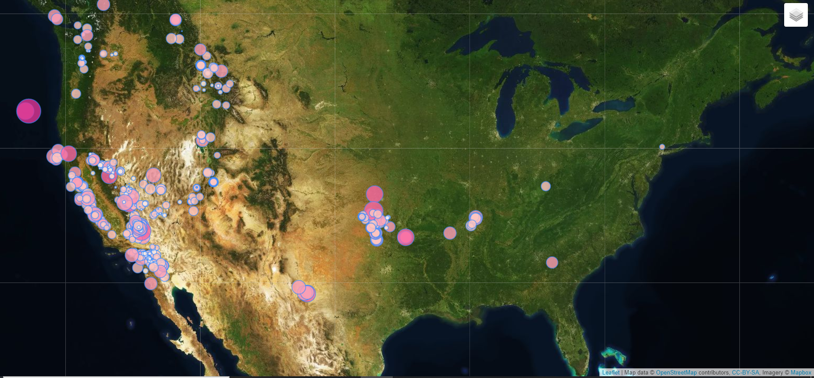

Visualizing Data with Leaflet

Objective:- visualize an earthquake data set obtained from [USGS GeoJSON Feed](http://earthquake.usgs.gov/earthquakes/feed/v1.0/geojson.php) page

methods
- Leaflet
- HTML-js-CSS

