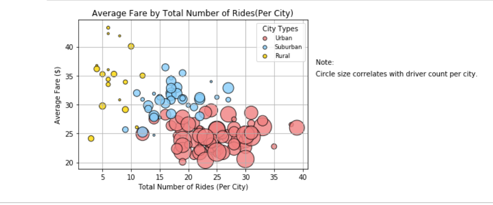

Objective:- to build a plot/chart to tell a story using UBER ride data and city data.

Data analysis were done with Python Pandas Jupyter Notebook. Inner join method were used to merge two Uber csv files. Aggregation were performed using groupby function for dataframe columns. Statistics were obtained by count, percentage calculation and average calculations.
 
Technologies
- Python 
    - Matplotlib
    - Pandas
    - Jupyter-Notebook

 
 

