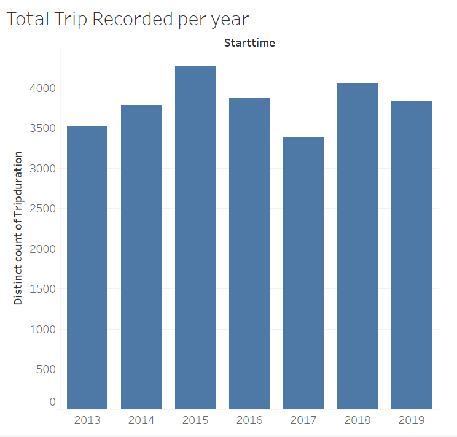
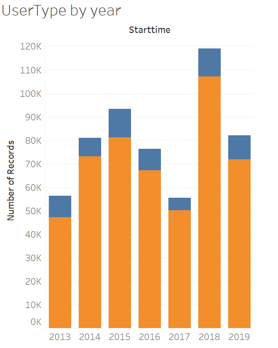
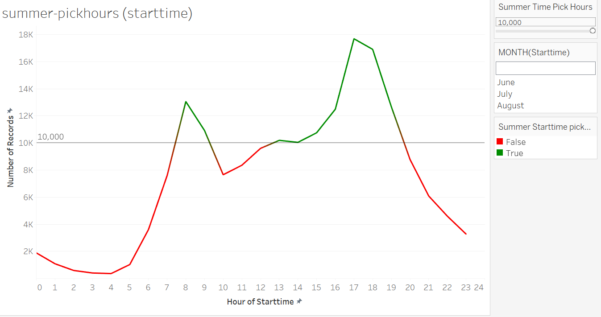

# Tableau - Citi Bike sample analysis

on progess ------

citi bike csv data were downloaded from [Citi Bike Data](https://www.citibikenyc.com/system-data) webpage stating from 2013 to 2019. For each year, monthly data column name renamed, date format changed to similar format and datasets were merged using jupyter Notebook. From 57,377,129 records 1% of dataset randomly sampled for sample analyses.

 

 

