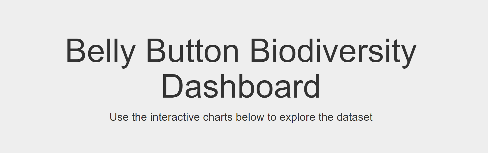
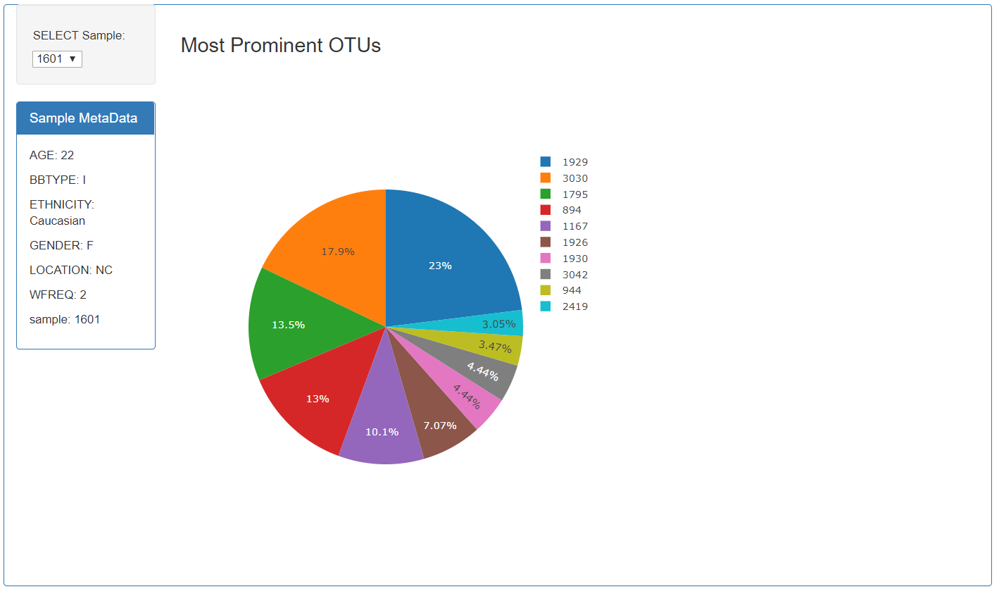
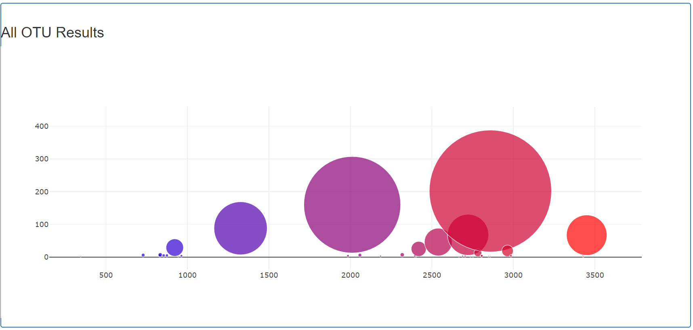

Objective:- to build an interactive web dashboard to explore the [Belly Button Biodiversity DataSet](http://robdunnlab.com/projects/belly-button-biodiversity/)

Methods

	- create python script to perform sql query and build app.py
	- create app.js to build interactive chart 
	- deploy heroku app 

Technologies

	- Plotly.js
	- JavaScript
	- HTML
	- Python libraries 
	- SQLAlchemy
	- Flask
	- SQLite
	- Heroku 

Requirements 

	- Procfile file
	- requirements.txt
	- runtime.txt

 

 

 

Heroku App link  
https://mycoolbbbapp.herokuapp.com

